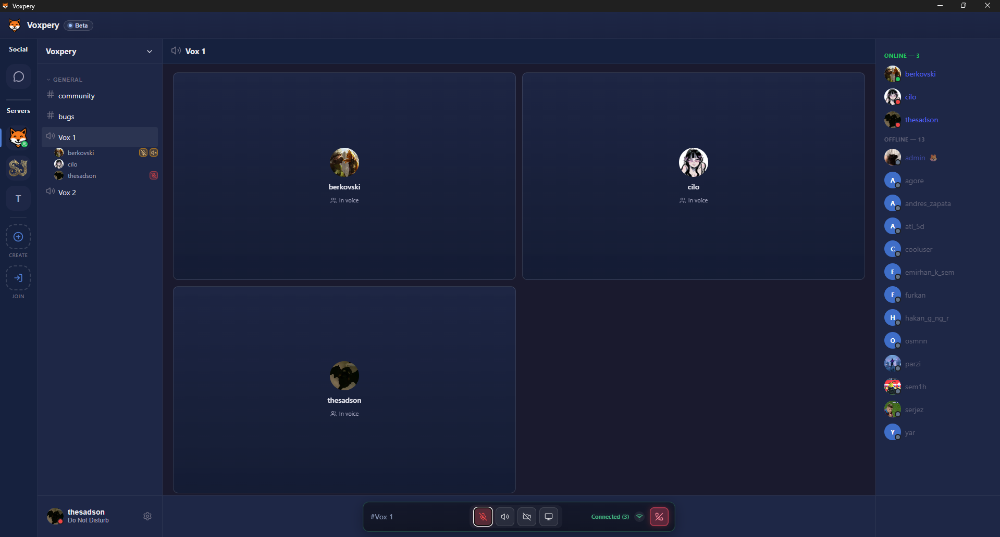

<div align="center">

#  Voxpery 

**Open-source, privacy-first communication platform**

[](LICENSE)
[](https://github.com/emircanagac/voxpery/actions/workflows/ci.yml)
[](https://github.com/emircanagac/voxpery/discussions)
[](https://www.rust-lang.org/)
[](https://react.dev/)

*Your data is yours. Voice, text, and real-time presence.*

**[→ Use at voxpery.com](https://voxpery.com)** · **[Self-host guide](#production-deployment)** · **[Join community](#community)**




</div>

---

## Why Voxpery?

Use Voxpery instantly on **voxpery.com** as a hosted Discord alternative, or self-host the same stack for full data ownership.

| Feature | Voxpery | Discord | Slack | Mattermost |
|---------|---------|---------|-------|-----------|
| **Open-source model** | ✅ AGPL-3.0 | ❌ Proprietary | ❌ Proprietary | ⚠️ Open-core |
| **Self-hostable** | ✅ Full stack | ❌ No | ❌ No | ✅ Yes |
| **Data control / privacy** | ✅ Self-host + no telemetry by default | ⚠️ SaaS data collection policies | ⚠️ SaaS data collection policies | ✅ Strong self-host control |
| **Voice calling** | ✅ LiveKit SFU | ✅ Native voice | ⚠️ Huddles (free plan limits) | ✅ Calls plugin |
| **Desktop app stack** | ✅ Tauri | ⚠️ Proprietary desktop client | ⚠️ Electron desktop client | ⚠️ Electron desktop client |
| **Pricing model** | ✅ OSS / self-host free | ⚠️ Freemium (Nitro) | ⚠️ Freemium + paid tiers | ⚠️ OSS + paid enterprise tiers |
| **Source code visibility** | ✅ Public repo | ❌ Core closed | ❌ Core closed | ✅ Public repo (open-core) |

---

## Features

### Communication
- 🎙️ **Crystal-clear voice** — LiveKit SFU, auto quality adaptation, screen sharing
- 💬 **Text & DMs** — Servers, channels, direct messages with real-time typing
- 👥 **Friends & social** — Add friends, see status, mutual presence

### Security & Privacy
- 🔒 **Secure auth defaults** — JWT + Argon2id, httpOnly cookies, Google OAuth support
- 🛡️ **No tracking** — Zero analytics, zero telemetry, zero ads
- 🏠 **Self-hosted** — Full control of your data, run on your server
- 📎 **Scoped attachment access** — Signed URLs + server/DM viewer authorization
- 🔐 **Open source** — Audit-ready code, AGPL license

### Performance
- ⚡ **Lightweight desktop client** — Tauri-based app with low runtime overhead
- 🚀 **Fast deployment** — Docker Compose, one command
- 📦 **Scalable** — PostgreSQL + Redis, horizontal scaling ready


## Stack

| Layer    | Tech |
|----------|------|
| Backend  | Rust, Axum |
| DB       | PostgreSQL |
| Cache    | Redis |
| Voice    | LiveKit SFU |
| Frontend | React 19, TypeScript 5, Vite 7 |
| Auth     | JWT, Argon2id, httpOnly cookie, Google OAuth |

## Quick Start

### For Users: No Setup Required

**Use the hosted app:** [voxpery.com](https://voxpery.com)
- Sign up → Create/join servers → Start voice
- No credit card, no data collection
- Same open-source code as self-hosted version

### For Self-Hosters: Deploy Your Own

**Easiest:** Run the full stack with Docker Compose

```bash
git clone https://github.com/emircanagac/voxpery.git
cd voxpery

# Copy and edit environment
cp .env.example .env

# Start full stack (postgres + redis + livekit + backend + web)
docker compose up -d --build

# Open http://localhost:5173
```

Note: ClamAV runs in Compose by default. File scanning is controlled by `ATTACHMENTS_CLAMAV_ENABLED` in `.env`.

**Need production setup?** → See [**Deployment Guide**](docs/DEPLOYMENT.md)
- Full Docker Compose deployment
- Reverse proxy/TLS options
- Backup and operations checklist

**For developers:** See [Contributing Guide](docs/CONTRIBUTING.md)

### Desktop App

```bash
# Terminal 1: run web dev server used by Tauri devUrl
cd apps/web
npm ci
npm run dev

# Terminal 2: run desktop shell
cd apps/desktop/src-tauri
cargo tauri dev
```

---

## Production Deployment

See [**docs/DEPLOYMENT.md**](docs/DEPLOYMENT.md) for complete setup guide covering:

- **Docker Compose** — Full stack (Postgres, Redis, LiveKit, backend, web)
- **Prebuilt images** — Optional Docker Hub publish workflow for faster production deploys
- **Nginx + TLS** — Reverse proxy and certificate setup (optional, for domain deployment)
- **Troubleshooting** — Health checks, backups, monitoring, performance tuning

**TL;DR local setup:**
```bash
docker compose up -d --build  # Full stack
# Open http://localhost:5173
```

---

## Documentation

- **[CONTRIBUTING.md](docs/CONTRIBUTING.md)** — Development setup, workflow, contribution areas
- **[CODE_OF_CONDUCT.md](docs/CODE_OF_CONDUCT.md)** — Community standards, enforcement
- **[SECURITY.md](SECURITY.md)** — Private vulnerability reporting policy and supported versions
- **[ROADMAP.md](docs/ROADMAP.md)** — Feature priorities & roadmap through Q4 2026
- **[PROJECT_OPERATIONS.md](docs/PROJECT_OPERATIONS.md)** — Support, governance, and release workflow
- **[RELEASE_SMOKE_TEST_CHECKLIST.md](docs/RELEASE_SMOKE_TEST_CHECKLIST.md)** — Mandatory release sign-off checklist (web + desktop)
- **[DESKTOP_RELEASE_HARDENING.md](docs/DESKTOP_RELEASE_HARDENING.md)** — Desktop metadata/deep-link/signing hardening policy
- **[OPERATIONS_RUNBOOK.md](docs/OPERATIONS_RUNBOOK.md)** — Backup/restore automation, health checks, and production alerting
- **[CHANGELOG.md](docs/CHANGELOG.md)** — Notable changes by release
- **[docs/DEPLOYMENT.md](docs/DEPLOYMENT.md)** — Production deployment guide
- **[docs/](docs/)** — Architecture, voice system, API, database, security, development

---

## Community

- **[→ Join Voxpery Discussions](https://github.com/emircanagac/voxpery/discussions)** — Ask questions, get help, discuss features
- **[→ Report bugs / suggest features](https://github.com/emircanagac/voxpery/issues)**
- **[→ Read docs](docs/)**

---

## Star History

[](https://star-history.com/#emircanagac/voxpery&Date)

---

## License

[AGPL-3.0](LICENSE) — Free, open-source, forever. Your data is yours.
