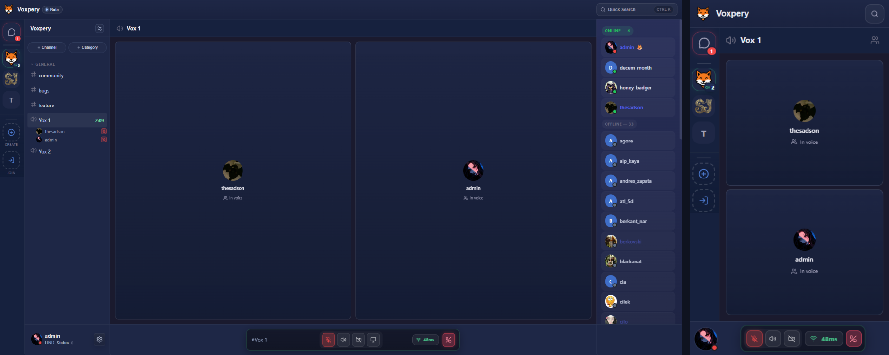

<div align="center">

#  Voxpery 

**A free, open-source Discord alternative for communities that want control**

[](LICENSE)
[](https://github.com/emircanagac/voxpery/actions/workflows/ci.yml)
[](https://github.com/emircanagac/voxpery/discussions)
[](https://www.rust-lang.org/)
[](https://react.dev/)

*Start chatting on the hosted service or deploy the same Rust, React, and LiveKit stack on your own infrastructure.*

**[Join the live community](https://voxpery.com/register)** | **[Self-host with Docker](docs/DEPLOYMENT.md)** | **[Download desktop](https://github.com/emircanagac/voxpery/releases/latest)** | **[View roadmap](docs/ROADMAP.md)**



</div>

---

## Why Voxpery?

Voxpery is a free, open-source Discord alternative for communities that want real-time chat and voice without giving up code transparency or data ownership. Use the hosted app on **voxpery.com**, or deploy the same stack yourself.

Choose Voxpery when you want:

- **A usable hosted service now** without operating your own infrastructure.
- **A real self-hosting path** backed by Docker deployment and operations documentation.
- **One public codebase** for the hosted web app, backend, and desktop clients.
- **Community essentials** including text chat, DMs, voice, screen sharing, moderation, and account data controls.

## Can I Trust Voxpery?

Voxpery is open source, so the hosted app and self-hosted version are built from public, reviewable code. You can inspect how authentication, attachments, voice, moderation, and data export/delete work instead of relying on a closed client.

- **Google sign-in does not give Voxpery your Google password.** Google OAuth only confirms your identity and returns the account information needed to sign you in.
- **No ads or analytics by default.** Voxpery is not built around tracking users or selling attention.
- **Self-hostable by design.** Communities that want full control can run the same stack on their own server.
- **Data controls are built in.** Users can export their account data and permanently delete their account.
- **Attachments are scoped.** Uploaded files use signed access and server/DM viewer authorization instead of public permanent links.

## Honest Comparison

| Feature | Voxpery | Discord | Slack | Mattermost |
|---------|---------|---------|-------|-----------|
| **Open-source model** | Yes: AGPL-3.0 | No: proprietary | No: proprietary | Partial: open-core |
| **Self-hostable** | Yes: full stack | No | No | Yes |
| **Data control / privacy** | Yes: self-host + no telemetry by default | SaaS data collection policies | SaaS data collection policies | Strong self-host control |
| **Voice calling** | LiveKit SFU | Native voice | Huddles (free plan limits) | Calls plugin |
| **Desktop app stack** | Tauri | Proprietary desktop client | Electron desktop client | Electron desktop client |
| **Pricing model** | OSS / self-host free | Freemium (Nitro) | Freemium + paid tiers | OSS + paid enterprise tiers |
| **Source code visibility** | Public repo | Core closed | Core closed | Public repo (open-core) |

Voxpery is not trying to beat mature commercial platforms on every enterprise feature today. Discord and Slack still have bigger ecosystems, polished mobile apps, app directories, and years of edge-case hardening. Mattermost is more mature for enterprise compliance and large deployments.

Voxpery is strongest when you want a smaller, inspectable, self-hostable community platform with hosted access available now, modern voice through LiveKit, no analytics by default, and a roadmap focused on open community ownership.

---

## Features

### Communication
- **Crystal-clear voice** - LiveKit SFU, auto quality adaptation, screen sharing
- **Text & DMs** - Servers, channels, direct messages with real-time typing
- **Friends & social** - Add friends, see status, mutual presence
- **Fast navigation** - Quick switcher for server, channel, and DM jumps
- **Reactions & attachments** - Emoji reactions, uploads, signed attachment access

### Security & Privacy
- **Secure auth defaults** - JWT + Argon2id, httpOnly cookies, Google OAuth support
- **No tracking** - Zero analytics, zero telemetry, zero ads
- **Self-hosted** - Full control of your data, run on your server
- **Scoped attachment access** - Signed URLs + server/DM viewer authorization
- **Open source** - Audit-ready code, AGPL license
- **Trust & safety basics** - User/message reporting, bans, audit log, moderation surfaces

### Performance
- **Lightweight desktop client** - Tauri-based app with low runtime overhead
- **Fast deployment** - Docker Compose, one command
- **Scalable** - PostgreSQL + Redis, horizontal scaling ready
- **Desktop feedback** - Tray unread dot and taskbar attention on desktop


## Stack

| Layer    | Tech |
|----------|------|
| Backend  | Rust, Axum |
| DB       | PostgreSQL |
| Cache    | Redis |
| Voice    | LiveKit SFU |
| Frontend | React 19, TypeScript 5, Vite 7 |
| Auth     | JWT, Argon2id, httpOnly cookie, Google OAuth |

## Quick Start

### For Users: No Setup Required

**Use the hosted app:** [voxpery.com](https://voxpery.com)
- Sign up -> Create/join servers -> Start voice
- No credit card, no data collection
- Same open-source code as self-hosted version

### For Self-Hosters: Deploy Your Own

**Easiest:** Run the full stack with Docker Compose

```bash
git clone https://github.com/emircanagac/voxpery.git
cd voxpery

# Copy the environment template.
cp .env.example .env

# Edit `.env` and replace every CHANGE_ME value before starting.
# Optional integrations can stay commented out.

# Validate the Compose configuration generated from `.env`.
docker compose config >/dev/null

# Start full stack (postgres + redis + livekit + backend + web)
docker compose up -d --build

# Open http://localhost:5173
```

Note: ClamAV is disabled by default. To enable malware scanning, set `ATTACHMENTS_CLAMAV_ENABLED=1` and start Compose with `--profile security`.

Self-host smoke check:

```bash
docker compose ps
curl -f http://localhost:3001/health
curl -I http://localhost:5173
curl -s http://localhost:3001/api/system/features
```

With the default `.env.example` flow, Google OAuth, SMTP email delivery, password reset, and email verification are disabled and hidden until configured.

**Need production setup?** See [**Deployment Guide**](docs/DEPLOYMENT.md)
- Full Docker Compose deployment
- Reverse proxy/TLS options
- Backup and operations checklist

Optional integrations are disabled unless fully configured. If Google OAuth or SMTP email delivery is not configured, Voxpery hides the related sign-in, password reset, and email verification flows and the API returns `FEATURE_DISABLED` for direct calls. Keep optional environment variables commented out when disabled; do not uncomment them with empty values.

**For developers:** See [Contributing Guide](docs/CONTRIBUTING.md)

### Desktop App

```bash
# Terminal 1 : run backend + web stack
docker compose up -d --build

# Terminal 2 : run desktop shell with dev-only localhost access
cd apps/desktop/src-tauri
cargo tauri dev --config tauri.dev.conf.json
```

---

## Production Deployment

See [**docs/DEPLOYMENT.md**](docs/DEPLOYMENT.md) for complete setup guide covering:

- **Docker Compose** - Full stack (Postgres, Redis, LiveKit, backend, web)
- **Prebuilt images** - Optional Docker Hub publish workflow for faster production deploys
- **Nginx + TLS** - Reverse proxy and certificate setup (optional, for domain deployment)
- **Troubleshooting** - Health checks, backups, monitoring, performance tuning

**TL;DR local setup:**
```bash
docker compose up -d --build  # Full stack
# Open http://localhost:5173
```

---

## Documentation

- **[CONTRIBUTING.md](docs/CONTRIBUTING.md)** - Development setup, workflow, contribution areas
- **[CODE_OF_CONDUCT.md](docs/CODE_OF_CONDUCT.md)** - Community standards, enforcement
- **[SECURITY.md](SECURITY.md)** - Private vulnerability reporting policy and supported versions
- **[ROADMAP.md](docs/ROADMAP.md)** - Product pillars, completed work, and current priorities
- **[PROJECT_OPERATIONS.md](docs/PROJECT_OPERATIONS.md)** - Support, governance, and release workflow
- **[RELEASE_SMOKE_TEST_CHECKLIST.md](docs/RELEASE_SMOKE_TEST_CHECKLIST.md)** - Mandatory release sign-off checklist (web + desktop)
- **[DESKTOP_RELEASE_HARDENING.md](docs/DESKTOP_RELEASE_HARDENING.md)** - Desktop metadata/deep-link/signing hardening policy
- **[OPERATIONS_RUNBOOK.md](docs/OPERATIONS_RUNBOOK.md)** - Backup/restore automation, health checks, and production alerting
- **[CHANGELOG.md](docs/CHANGELOG.md)** - Notable changes by release
- **[docs/DEPLOYMENT.md](docs/DEPLOYMENT.md)** - Production deployment guide
- **[docs/](docs/)** - Architecture, voice system, API, database, security, development

---

## Community

- **[Join Voxpery Discussions](https://github.com/emircanagac/voxpery/discussions)** - Ask questions, get help, discuss features
- **[Report bugs / suggest features](https://github.com/emircanagac/voxpery/issues)**
- **[Read docs](docs/)**

---

## Star History

[](https://star-history.com/#emircanagac/voxpery&Date)

---

## License

[AGPL-3.0](LICENSE) - Free, open-source, forever. Your data is yours.
